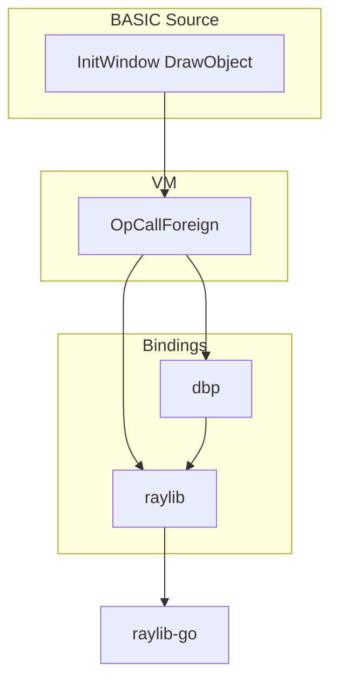

# Modular Compiler Architecture (DBPro-Style)

Split the compiler into five clear, isolated groups. Each group has a single responsibility; no cross-boundary logic.

**Implementation status:** Lexer, Parser, Semantic, and Codegen are implemented. The driver (`compiler/compiler.go`) is a thin orchestration layer: Lex → Parse → Semantic.Analyze → Codegen.Emit. It also exposes a **staged API** (`Tokenize`, `ParseTokens`, `Parse`, `Analyze`, `CompileWithOptions`) so tools and tests can stop at any phase without reimplementing the lexer/parser. All codegen logic lives in `compiler/codegen/` (codegen.go, stmt.go, expr.go, call.go, util.go). See [ARCHITECTURE.md](ARCHITECTURE.md#compiler-engine-staged-api) for the phase table and extension notes.

---

## 1. Lexer Module

**Responsibility:** Tokenizing only — keywords, identifiers, numbers, strings. **No parsing.**

| Group | Path | Purpose |
|-------|------|---------|
| Lexer | `compiler/lexer/lexer.go` | Lexer: reads source, emits tokens |
| Lexer | `compiler/lexer/token.go` | Token types, keyword map |

**Allowed:** Character/string scanning, keyword recognition, number/string literals.  
**Not allowed:** Grammar, AST, or any parsing logic.

---

## 2. Parser Module

**Responsibility:** Grammar and AST only — expressions, statements, loops, functions. **No code generation.**

| Group | Path | Purpose |
|-------|------|---------|
| Parser | `compiler/parser/parser.go` | Parser: consumes tokens, builds AST |
| Parser | `compiler/parser/ast.go` | AST node types (Program, Call, IfStatement, etc.) |
| Parser | `compiler/parser/parser_test.go` | Parser unit tests |

**Allowed:** Imports `lexer` for token types. Builds and returns AST only.  
**Not allowed:** Emitting bytecode, VM, or any codegen.

---

## 3. Semantic Analysis Module

**Responsibility:** Variable declarations, type checking, scope rules, function signatures. **No parsing, no codegen.**

| Group | Path | Purpose |
|-------|------|---------|
| Semantic | `compiler/semantic/semantic.go` | Semantic pass: walk AST, build symbol table, check types/scopes |
| Semantic | `compiler/semantic/symbol.go` | Symbol table (Result: TypeDefs, EntityNames, UserFuncs, MainStmts, Decls) |

**Current state:** Implemented. `semantic.Analyze(program)` returns a read-only `Result` consumed by codegen.

**Input:** AST (from parser).  
**Output:** Symbol table / annotated info (e.g. type definitions, user function/sub names, scope) for codegen. No bytecode.

---

## 4. Code Generation Module

**Responsibility:** Emitting bytecode / VM instructions, mapping BASIC to runtime calls, producing the final program. **No parsing, no lexing.**

| Group | Path | Purpose |
|-------|------|---------|
| Codegen | `compiler/codegen/codegen.go` | Entry: `Emit(program, semantic.Result)` → `*vm.Chunk` |
| Codegen | `compiler/codegen/stmt.go` | Compile statements (IF, FOR, WHILE, REPEAT, DIM, etc.) |
| Codegen | `compiler/codegen/expr.go` | Compile expressions (binary, unary, call, member, etc.) |
| Codegen | `compiler/codegen/call.go` | Compile function/procedure calls |
| Codegen | `compiler/codegen/util.go` | Helpers (physics namespace map, WalkStatements, frame/3D predicates) |
| Driver | `compiler/compiler.go` | Single **`fullPipeline`** for every full compile (`Compile` / `CompileWithOptions`); staged `Tokenize`, `Parse`, `Analyze` for tools; CLI and `--gen-go` use the same `compiler` package |

**Allowed:** Imports `parser` (AST), `vm` (Chunk, opcodes), `semantic` (Result). Emits bytecode only.  
**Not allowed:** Tokenizing, parsing, or semantic checks (those stay in Lexer/Parser/Semantic).

**Current state:** Implemented. All codegen lives in `compiler/codegen/`; `compiler.go` is a thin driver.

---

## 5. Runtime / Standard Library Module

**Responsibility:** Raylib bindings, math, file I/O, strings, game helpers. **Separate from the compiler.** No compilation logic here.

| Group | Path | Purpose |
|-------|------|---------|
| VM | `compiler/vm/bytecode.go` | Bytecode and opcode definitions |
| VM | `compiler/vm/vm.go` | VM execution |
| VM | `compiler/vm/runtime_iface.go` | Runtime interface for VM |
| VM | `compiler/vm/vm_test.go` | VM tests |
| Bindings | `compiler/bindings/raylib/*.go` | Raylib: core, shapes, 3d, input, text, images, audio, ui, raygui, game, misc, views, editor, fog, fonts, mesh, textures |
| Bindings | `compiler/bindings/box2d/box2d.go` | Box2D 2D physics |
| Bindings | `compiler/bindings/bullet/bullet.go` | Bullet 3D physics |
| Bindings | `compiler/bindings/ecs/ecs.go` | ECS |
| Bindings | `compiler/bindings/net/net.go` | Networking |
| Bindings | `compiler/bindings/sql/sql.go` | SQLite |
| Bindings | `compiler/bindings/std/std.go` | Standard lib (math, strings, file I/O) |
| Bindings | `compiler/bindings/scene/scene.go` | Scene |
| Runtime | `compiler/runtime/runtime.go` | High-level runtime (sprites, models, cameras, etc.) |
| Tooling | `compiler/gogen/gogen.go` | Go source generation (optional; can live under runtime/tooling) |

**Allowed:** Registering foreign functions with VM, file I/O, math, graphics, physics, etc.  
**Not allowed:** Lexing, parsing, semantic analysis, or bytecode emission.

---

## 6. Raylib Integration

Raylib is the low-level graphics backend. The integration is modular and layered:

- **Layering:** Raylib bindings (`bindings/raylib/`) provide the flat API (InitWindow, DrawRectangle). DBP bindings (`bindings/dbp/`) are high-level wrappers (LoadObject, DrawLevel) built on raylib.
- **Modular bindings:** Raylib is split by domain (raylib_core.go, raylib_shapes.go, raylib_3d.go, etc.); `RegisterRaylib()` wires them.
- **Renderer:** `compiler/runtime/renderer/` orchestrates 3D→2D→GUI; uses raylib for drawing, DBP for object draw callbacks.
- **VM:** Foreign function registration; compiler emits `OpCallForeign`; no compile-time raylib dependency.

---

## File-to-Group Summary

| Module | Files (existing + new) |
|--------|------------------------|
| **Lexer** | `lexer/lexer.go`, `lexer/token.go` |
| **Parser** | `parser/parser.go`, `parser/ast.go`, `parser/parser_test.go` |
| **Semantic** | `semantic/semantic.go`, `semantic/symbol.go`, `semantic/semantic_test.go` |
| **Codegen** | `codegen/codegen.go`, `codegen/stmt.go`, `codegen/expr.go`, `codegen/call.go`, `codegen/util.go`; `compiler.go` is thin driver |
| **Runtime** | `vm/*.go`, `bindings/**/*.go`, `runtime/runtime.go`, `gogen/gogen.go` |
| **Tests** | `compiler_test.go` — stays in `compiler` or moves to `codegen` for codegen tests |

---

## All files by group (full list)

**Group 1 — Lexer**  
- `compiler/lexer/lexer.go`  
- `compiler/lexer/token.go`  

**Group 2 — Parser**  
- `compiler/parser/parser.go`  
- `compiler/parser/ast.go`  
- `compiler/parser/parser_test.go`  

**Group 3 — Semantic (new)**  
- `compiler/semantic/semantic.go`  
- `compiler/semantic/symbol.go`  

**Group 4 — Codegen + driver**  
- `compiler/compiler.go` (slim driver only)  
- `compiler/codegen/codegen.go` (new)  
- `compiler/codegen/stmt.go` (new)  
- `compiler/codegen/expr.go` (new)  
- `compiler/compiler_test.go`  

**Group 5 — Runtime / standard library**  
- `compiler/vm/bytecode.go`  
- `compiler/vm/vm.go`  
- `compiler/vm/runtime_iface.go`  
- `compiler/vm/vm_test.go`  
- `compiler/runtime/runtime.go`  
- `compiler/gogen/gogen.go`  
- `compiler/bindings/raylib/raylib.go`  
- `compiler/bindings/raylib/raylib_core.go`  
- `compiler/bindings/raylib/raylib_shapes.go`  
- `compiler/bindings/raylib/raylib_3d.go`  
- `compiler/bindings/raylib/raylib_input.go`  
- `compiler/bindings/raylib/raylib_text.go`  
- `compiler/bindings/raylib/raylib_images.go`  
- `compiler/bindings/raylib/raylib_audio.go`  
- `compiler/bindings/raylib/raylib_ui.go`  
- `compiler/bindings/raylib/raylib_raygui.go`  
- `compiler/bindings/raylib/raylib_math.go`  
- `compiler/bindings/raylib/raylib_misc.go`  
- `compiler/bindings/raylib/raylib_game.go`  
- `compiler/bindings/raylib/raylib_views.go`  
- `compiler/bindings/raylib/raylib_editor.go`  
- `compiler/bindings/raylib/raylib_fog.go`  
- `compiler/bindings/raylib/raylib_fonts.go`  
- `compiler/bindings/raylib/raylib_mesh.go`  
- `compiler/bindings/raylib/raylib_textures.go`  
- `compiler/bindings/box2d/box2d.go`  
- `compiler/bindings/bullet/bullet.go`  
- `compiler/bindings/ecs/ecs.go`  
- `compiler/bindings/net/net.go`  
- `compiler/bindings/sql/sql.go`  
- `compiler/bindings/std/std.go`  
- `compiler/bindings/scene/scene.go`  

**Entry (outside compiler groups)**  
- `main.go`

---

## Dependency Rules

- **Lexer:** no compiler-internal deps (only stdlib).
- **Parser:** may depend on **Lexer** (tokens only).
- **Semantic:** may depend on **Parser** (AST types only). No VM, no codegen.
- **Codegen:** may depend on **Parser** (AST), **VM** (Chunk), **Semantic** (symbol table). No Lexer, no Parser internals beyond AST.
- **Runtime:** may depend on **VM** (for registration). No Lexer, Parser, Semantic, Codegen.
- **Driver** (`compiler.go`): depends on Lexer, Parser, Semantic, Codegen, VM (to run); orchestrates only.

---

## Implementation Order

1. **Semantic:** Add `compiler/semantic/`; move type-def and user-func collection (and any other semantic checks) out of `compiler.go` into `semantic.Analyze(ast)`.
2. **Codegen:** Add `compiler/codegen/`; move all `generateCode` and `compile*` logic from `compiler.go` into codegen; codegen takes AST + semantic result, returns `*vm.Chunk`.
3. **Driver:** Slim `compiler.go` to: Lexer → Parser → Semantic.Analyze → Codegen.Emit → return Chunk (and optionally run via VM).
4. **Tests:** Update `compiler_test.go` and any imports; add `codegen` tests if desired.
5. **Docs:** Keep this file; optionally add one-paragraph summaries in each package’s doc comment.
